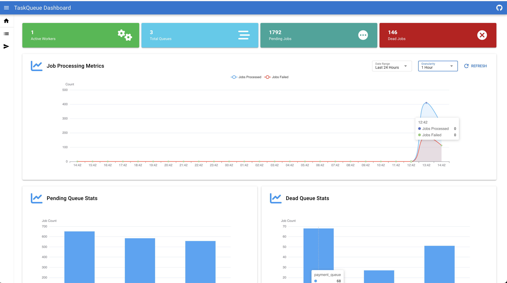
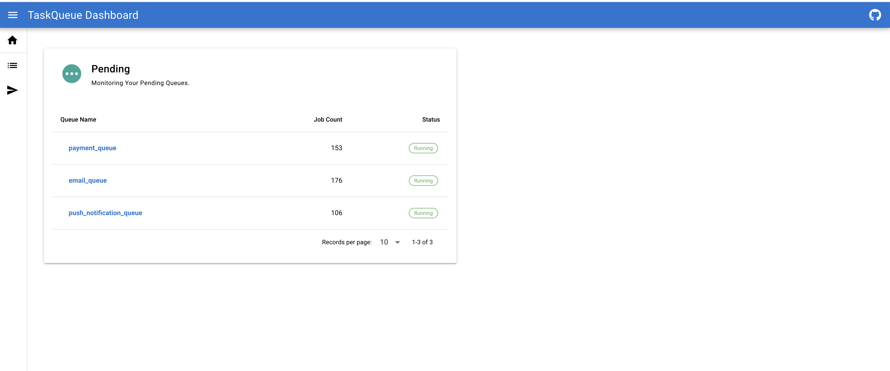

# TaskQueue-Go

[](https://godoc.org/github.com/oshankkumar/taskqueue-go)
[](https://opensource.org/licenses/MIT)


[](https://goreportcard.com/report/github.com/oshankkumar/taskqueue-go)


**TaskQueue-Go** is a high-performance, distributed task queue library for Go, designed to simplify background job
processing. With support for multiple queue backends and job storage backends, along with a pluggable architecture, it
provides a scalable and reliable system for decoupling task execution from your main application logic. The decoupled
design enables independent scaling and optimization of the queuing system and job storage.

---

## Features

- **Distributed Task Queues**: Seamlessly enqueue and process tasks across distributed systems.
- **Customizable Queues**: Configure worker concurrency, job timeouts, and task handlers for each queue.
- **Retries of Failed Jobs**: Automatically retries failed jobs based on configurable retry policies.
- **Scheduled Jobs**: Allows scheduling of jobs to be executed after a delay.
- **Backend Flexibility**: Initial support for Redis as a queue backend, with room for additional implementations.
- **Atomic Dequeueing**: Ensures tasks are processed reliably using Redis Lua scripts.
- **Pluggable Architecture**: Easily extend with custom implementations for enqueuing and job storage. This decoupled
  architecture allows you to independently scale and optimize the queuing system and job storage based on your needs.
- **Dashboard**: TaskQueue-Go includes a feature-rich dashboard for monitoring queues and managing jobs.

---

## Installation

```bash
go get github.com/oshankkumar/taskqueue-go
```

---

## Getting Started

### 1. Setting Up the Enqueuer

```go
package main

import (
	"context"

	"github.com/oshankkumar/taskqueue-go"
	"github.com/redis/go-redis/v9"
	redisq "github.com/oshankkumar/taskqueue-go/redis"
)

const ns = "taskqueue"

func main() {
	rc := redis.NewClient(&redis.Options{Addr: ":6379"})

	// Initialize Redis-backed enqueuer
	enq := redisq.NewQueue(rc, redisq.WithNamespace(ns))

	job := taskqueue.NewJob()
	err := job.JSONMarshalPayload(map[string]string{
		"to":      "user@example.com",
		"subject": "Welcome!",
	})
	if err != nil {
		panic(err)
	}

	err = enq.Enqueue(context.Background(), job, &taskqueue.EnqueueOptions{
		QueueName: "email_jobs",
	})

	if err != nil {
		panic(err)
	}
}

```

### 2. Setting Up a Worker to Process Jobs

```go
package main

import (
	"context"
	"fmt"
	"os"
	"os/signal"

	"github.com/oshankkumar/taskqueue-go"
	"github.com/redis/go-redis/v9"
	redisq "github.com/oshankkumar/taskqueue-go/redis"
)

const ns = "taskqueue"

func main() {
	rc := redis.NewClient(&redis.Options{Addr: ":6379"})

	worker := taskqueue.NewWorker(&taskqueue.WorkerOptions{
		Queue:          redisq.NewQueue(rc, redisq.WithNamespace(ns), redisq.WithCompletedJobTTL(time.Hour)),
		HeartBeater:    redisq.NewHeartBeater(rc, redisq.WithNamespace(ns)),
		MetricsBackend: redisq.NewMetricsBackend(rc, redisq.WithNamespace(ns)),
	})

	worker.RegisterHandler("email_jobs", taskqueue.HandlerFunc(func(ctx context.Context, job *taskqueue.Job) error {
		fmt.Printf("Processing job: %+v\n", job)
		return nil // Return an error if the job fails
	}), taskqueue.WithConcurrency(8))

	ctx, cancel := signal.NotifyContext(context.Background(), os.Interrupt, syscall.SIGTERM)
	defer cancel()

	worker.Start(ctx)

	<-ctx.Done()
	worker.Stop()
}

```

---

## Running TaskQueue Manager

### Running Locally

To run the TaskQueue Manager locally:

1. **Clone the repository:**

```
git clone https://github.com/oshankkumar/taskqueue-go.git
cd taskqueue-go
```

2. **Build Dashboard:**

```
cd taskmanager/taskqueue-web
yarn install
yarn build
```

3. **Build and run the manager:**

```
go build -o taskqueue-manager ./cmd/taskqueue-manager
./taskqueue-manager -listen=:8050 -namespace=taskqueue-go -redis-heartbeat-addr=redis:6379 -redis-queue-addr=redis:6379 -redis-metrics-backend-addr=redis:6379 --static-web-dir=./taskmanager/taskqueue-web/dist/spa
```

You can access the dashboard at http://localhost:8050 when running the TaskQueue Manager.

### Running with Docker

To run the TaskQueue Manager using Docker:

```
docker run -p 8050:8050  oshank/taskqueue-manager:latest -listen=:8050 -namespace=taskqueue -redis-heartbeat-addr=redis:6379 -redis-metrics-backend-addr=redis:6379 -redis-queue-addr=redis:6379
```

You can access the dashboard at http://localhost:8050

## Dashboard

TaskQueue-Go comes with a nice dashboard for managing and monitoring your queues and jobs. The dashboard provides:

- **Queue Monitoring**: View real-time statistics for each queue, including the number of pending, dead jobs.
- **Job Management**: retry/delete dead jobs, enqueue/submit new jobs directly from the dashboard.
- **Queue Management**: Pause or Start a queue directly from dashboard.
- **Worker Status**: Monitor the status of workers.
- **Metrics**: Visualize key metrics.





## Advanced Usage

### Custom Job Storage

You can implement your own job storage by conforming to the `JobStore` interface:

```go
type JobStore interface {
  CreateOrUpdate(ctx context.Context, job *Job) error
  GetJob(ctx context.Context, jobID string) (*Job, error)
  DeleteJob(ctx context.Context, jobID string) error
  UpdateJobStatus(ctx context.Context, jobID string, status JobStatus) error
}
```

### Redis Lua Script for Atomic Dequeueing

The library leverages a Lua script to ensure atomic dequeuing and visibility timeout management:

---

## Roadmap

- Support for additional queueing backends. (e.g., RabbitMQ, Kafka).
- Support for additional job store backends. (e.g., Mysql, Postgres).
- Metrics and monitoring integrations.

---

## License

This project is licensed under the MIT License. See the [LICENSE](LICENSE) file for details.

